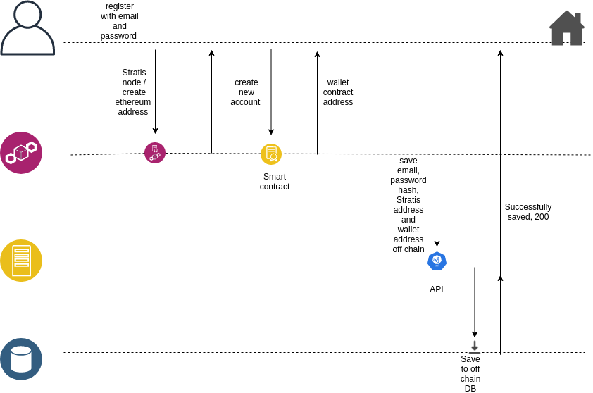
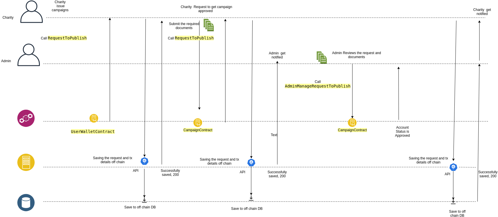
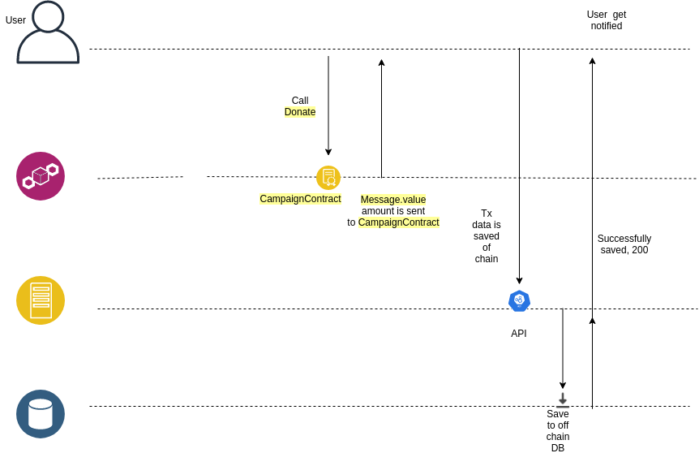
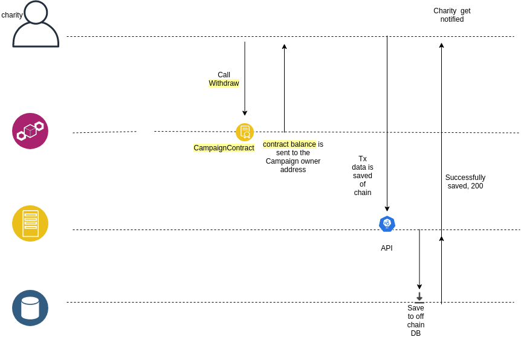

Ehsan Donation Smart Contracts
====================================================
Overview 
---------
Ehsan Donation scenario shows an example of how to facilitate donation cycle  and increase the trust between donors and charities through blockchain. 
	
Contracts 
------------------
- RegistrationContract
- UserWalletContract
- CampaignContract

Application Roles 
------------------

| Name       | Description                                                                                         |
|------------|-----------------------------------------------------------------------------------------------------|
| Admin| A person Who manage and review request from charities. 
| Charity      | A charity owner/manager who can issue campaigns after admin reviews and approves his account as well as  the campaign data (one smart contract for each Charity && one smart contract for each Campaign).                                     |

UserWalletContract Workflow States 
-------

| Name                 | Description                                                                                                 |
|----------------------|-------------------------------------------------------------------------------------------------------------|
| Initialized               | when the contract created                               |
| Submitted         | Indicates that the campaign owner has requested to join and submitted the required documents                                                                       |
| Approved   | Indicates that the admin has reviews the charity request and approved it                      |
| Rejected   | Indicates that the admin has reviewed the charity request and rejected it but charity still can resubmit                      |
| Banned   | Indicates that the admin has reviews the charity request and rejected as well as banned this account, so  charity can nor resubmit anymore                    |

 
CampaignContract Workflow States 
-------

| Name                 | Description                                                                                                 |
|----------------------|-------------------------------------------------------------------------------------------------------------|
| Issued               | when the contract created                               |
| Submitted         | Indicates that the campaign owner has requested to publish the campaign by submitting the required documents                                                                       |
| Opened   | Indicates that the admin has reviews the charity request and approved it and donor can donate                     |
| Rejected   | Indicates that the admin has reviewed the charity request and rejected it but charity still can resubmit                      |
| Finished   | Indicates that the campaign has been finished and donor can't donate                |

Workflow Details
----------------

Anyone can  register with  stratis address & email, “new wallet contract is generated and associated with this account  (on chain)“.

Charity submits a request to join ,
Kyc process is required  including submitting : 
	
Charity Registration and/or license  
 - Audit Report (if the charity has been operating for more than 2 years)
  - Annual/Activity report
   - Passport copy of the Manager
    - BankAccount
    - Cryptocurrencies Address “ for supporting other crypt currencies (not supported yet) “

 admin receives a notification for new request to be reviewed , after  reviewing KYC and he can accept or reject 
Charity receives a notification for the status update

Charity can issue campaign bu calling IssueCampaign and providing the cap (the amount of money they want get) , and endDate . an new smart contract is created and added to the charity's campaign's list.
charity owner has to request to publish this campaign submitting some documents  including submitting : 
	
Charity Registration and/or license  
  Audit Report (if the charity has been operating for more than 2 years)
   - Annual/Activity report
   - Passport copy of the Manager,
   -  BankAccount
    -Cryptocurrencies Address “ for supporting other crypt currencies (not supported yet) “

 admin receives a notification for new request to be reviewed , after  reviewing KYC and he can accept or reject 
Charity receives a notification for the status update. and if it's approved , campaign is listed in the cmapign explorer so that donor can view and donate. 

anyone can donate to campaign as long as it's open and hasn't reached the end date. 

Campaign owner can withdraw the donated money to his account from the campaign contract after closing it .

Application Files
-----------------

[Donation.cs](Donation.cs) - This file contains the code for the 3 contracts .

References
-----------------